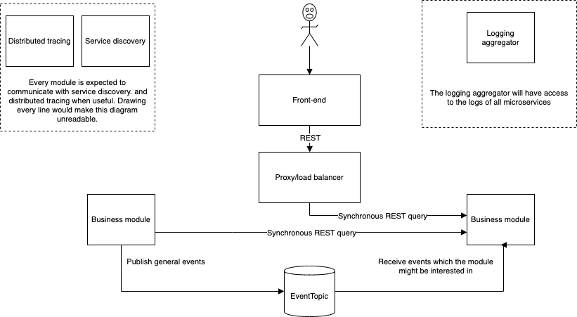

# Portal
My personal portal, helping me simplify my life. Or at least, that's the purpose :)

## Progress
Check out the [Trello board](https://trello.com/b/LlzGuRM3/portal).

## How to run this application?
To run and deploy the modules, each module is wrapped in a Docker container. All containers can be started at the same time with **Docker Swarm**.

1. Create a file with the name *.env*, containing secrets (like passwords). Have a look at *.env-example* to know the expected content.
1. Adapt the `docker-compose.yml` file to your needs.
1. `docker swarm init` (if you did not do this before)
1. `docker-compose config > docker-compose-for-swarm.yml && docker stack deploy -c docker-compose-for-swarm.yml portal`

## Architecture

### Why microservices?
I expect that the functionality of the portal will **change often. It adapts to my life**.

That why I have chosen to design the portal as microservices. The goal is to easily write new functionality and disable unused modules. This decision allows me to use different technologies, making it interesting to toy around with new technology hypes.

### Communication between modules
Since modules should be easily removed/replaced/introduced, it's important for modules to have as less dependencies on each other as possible. On the other hand, I expect the portal to be a smart, proactive system, which requires modules to be sharing data all the time.

**The preferred communication method is asynchronous, generic data exchange**. When something occurs that could be of interesting for other modules, the module is expected to publicize this information on the **Event topic**. Every other module that's interested will receive this information, doing something meaningful, or throwing the message away.

**In case that synchronous communication is required**, for example for queries of other modules so that information can be shown in the front-end, **REST  webservices should be used**. 

### The front-end
There is a **dedicated front-end module** which contains the front-end components for every backend module.

While this seems contradictory to backend's microservice approach, I have [good reasons](https://github.com/stainii/portal-front-end) for this set-up. This thinking is [explained in the README file of the front-end-module](https://github.com/stainii/portal-front-end).

## Development
### How do I run the application without Dockerizing my module again and again?
You can run the Spring Boot applications from your IDE. If you need to have a running database/eureka/..., use

1. `docker swarm init` (if you did not do this before)
1. `docker-compose -f docker-compose-resources-only.yml config > docker-compose-for-swarm.yml && docker stack deploy -c docker-compose-for-swarm.yml portal-resources-only`

### Helpful resources
* [List of Pluralsight courses](https://app.pluralsight.com/channels/details/f975a3ba-648f-401a-851c-0ab47fe552c1?s=1), explaining how to use the technologies and frameworks used by this portal.